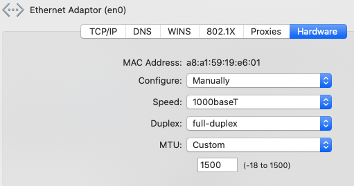

# Ryzentosh

## Updating to a new OpenCore version
1. Unpack the released `.zip` file into the EFI folder of this repo
1. `git pull` the latest changes from https://github.com/acidanthera/OcBinaryData and sync the changes in the _Resources_ folder `rsync -avz --delete Resources/ ../ryzentosh/EFI/OC/Resources`
1. Update the `config.plist` with `ProperTree.command` from https://github.com/corpnewt/ProperTree
1. Mount the local EFI folder by running `make mount`
1. Sync the changes from the repository to the mounted EFI folder by running `make sync-efi`
1. Unmount the local EFI folder again by running `make unmount`


## Hardware
- Motherboard: ASRock Fatal1ty B450 Gaming
    - Ethernet networking: Intel I211-AT Gbit LAN
    - WIFI networking and Bluetooth: Intel 3168 802.11ac (433mb/s) / BT 4.2 Combo
- CPU: AMD Ryzen 7 3700X 8x 3.6 GHz
- GPU: AMD Radeon RX 5700XT 8GB
- RAM: 2x 16 GB DDR4-3000

## macOS Catalina 10.15.7 (19H15)
Works:
- ethernet 1 GBit after setting

  

- WIFI, but slow, using [HeliPort](https://openintelwireless.github.io/HeliPort/#chat)
- USB ports (front of case, USB-C connected screen with integrated HUB)
- Bluetooth was only discovered after USB port mapping

## Post-installation configuration

Sometimes, Apple's key long-press feature to type accented characters gets disabled.
To re-activate it, run
```shell
defaults write -g ApplePressAndHoldEnabled -bool true
```
